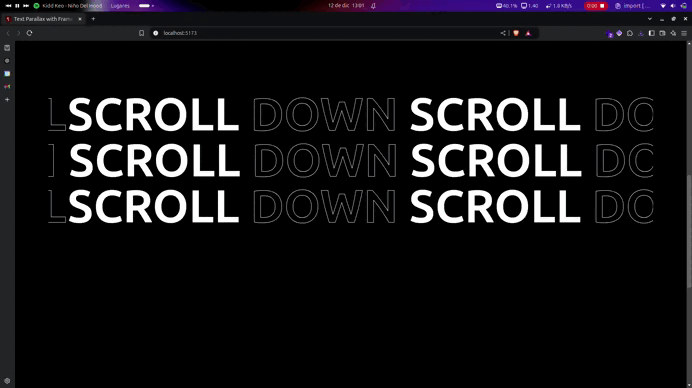

# Text Parallax with Framer Motion

# JQuery Mask Entry Animation
 
Implementation of a scrolling parallax text using Framer Motion and React.

Read blog post: [Medium/cpadlab](https://medium.com/@cpadlab)

## Requirements

- [Framer Motion](https://jquery.com/)
- [React](https://jquery.com/)
- [TailwindCSS](https://jqueryui.com/)

> [!NOTE]  
> You can find a pre-built in version in the /dist directory
  
## Install

```bash
git clone https://github.com/cpadlab/Framer-Motion-Text-Parallax
cd Framer-Motion-Text-Parallax && npm run dev
```

## Gallery



